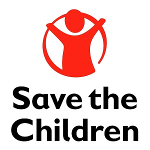
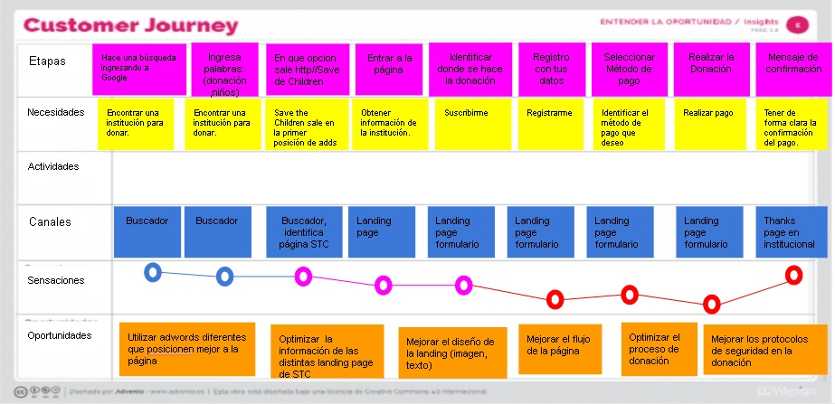
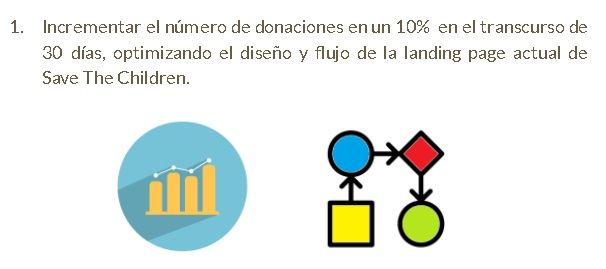
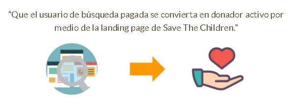
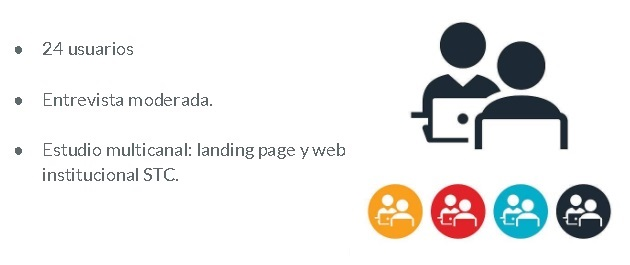
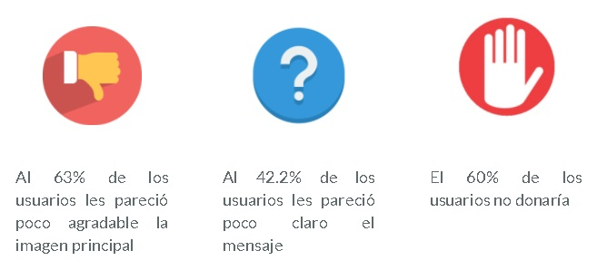
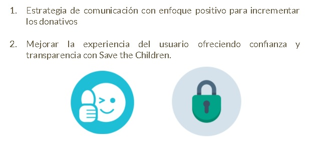
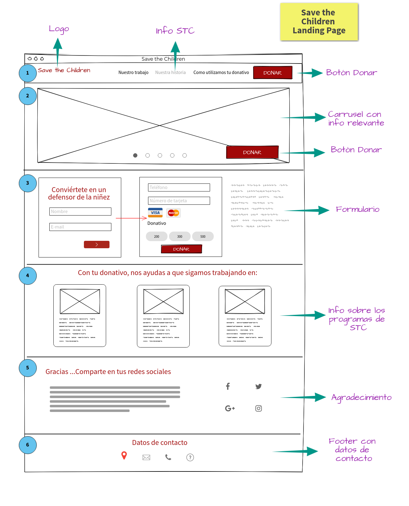
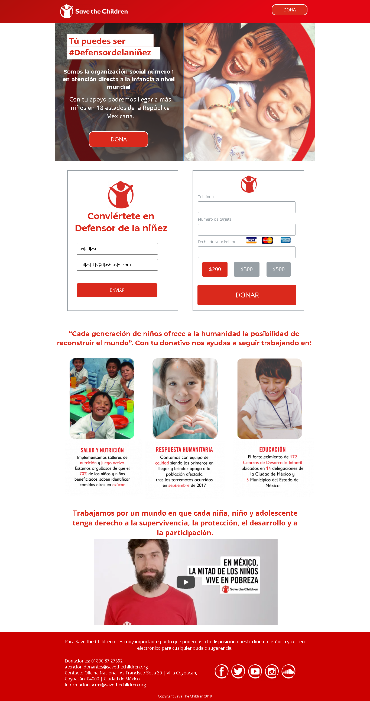

# Save The Children Landing Page

## Índice

1. Objetivos principales
2. El cliente
3. El usuario
4. Objetivos de negocio
5. Enunciado del problema
6. Research
7. Análisis de resultados
8. Propuesta de solución
9. Prototipo Landing Page
10. Conclusiones

## 1. Objetivos principales
- Homologar la distribución estratégica de contenido en todos los canales digitales, aumentando un 10% la percepción positiva de la organización en un plazo de 6 meses.
- Incrementar el número de donaciones desde la landing page  en un 10%  en el transcurso de 30 días.

## 2. El cliente
Save the Children es una organización no gubernamental que busca ayudar a niños, niñas y adolescentes con programas de protección, educación, salud y nutriión, entre otros, desde 1919 y en México desde 1973, con presencia en 18 entidades federativas.

El objetivo principal de Save the Children, es recaudar donativos por medio de distintos canales: F2F, vía telefónica y landing page. Este último canal tiene un buen porcentaje de tráfico, pero este no es proporcional con el número de conversiones que se realizan. Por este motivo, Save the Children busca que el usuario de búsqueda pagada se convierta en donador activo optimizando la landing page y mejorando la experiencia de usuario dentro de la misma.

## 3. El usuario
**Características:**
- Principales donantes mujeres de 30 a 75 años
- 35 a 45 (las donantes más fuertes)
- Cuenta con conexión a internet
- Inicia el proceso en la landing page pero concluye vía telefónica
en promedio dona $250 pesos al mes

**Objetivos del usuario**
- Satisfacer la necesidad de transparencia.
- Garantizar un proceso de donación y tratamiento de los datos personales, seguros.
- Proceso de donación intuitivo.
- Información concisa y clara.
- Imágenes que motiven a reforzar la sensación de altruismo y no de culpa.

**Journey del usuario**

**User persona**

## 4. Objetivo de negocio

## 5. Enunciado del problema

## 6. Research

## 7. Análisis de resultados
**Insights Relevantes**

## 8. Propuesta de solución

**Diseño Wireframe**
- Diseño limpio
- Información concreta y clara
- Imágenes con un enfoque positivo donde se muestre el trabajo de Save The Children

## 9. Prototipo Landing Page

## 10. Conclusiones
- El desarrollo del proyecto tuvo una buena organización.
- El diseño fue apegado a la imagen institucional, pero se hizo la observación de que se puede optimizar presentando una versión más libre y atractiva para el usuario.
